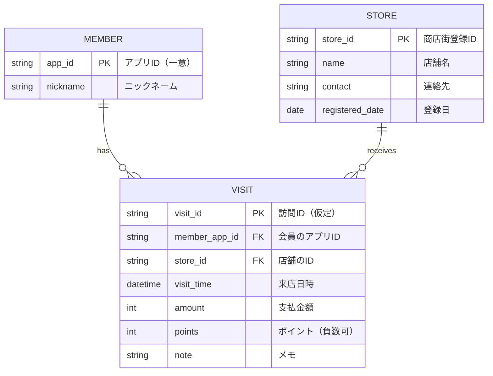

## 概念データモデル

```mermaid
erDiagram
    MEMBER {
        string app_id PK "アプリID（一意）"
        string nickname "ニックネーム"
    }

    STORE {
        string store_id PK "商店街登録ID"
        string name "店舗名"
        string contact "連絡先"
        date registered_date "登録日"
    }

    VISIT {
        string visit_id PK "訪問ID（仮定）"
        string member_app_id FK "会員のアプリID"
        string store_id FK "店舗のID"
        datetime visit_time "来店日時"
        int amount "支払金額"
        int points "ポイント（負数可）"
        string note "メモ"
    }

    MEMBER ||--o{ VISIT : has
    STORE ||--o{ VISIT : receives
```
