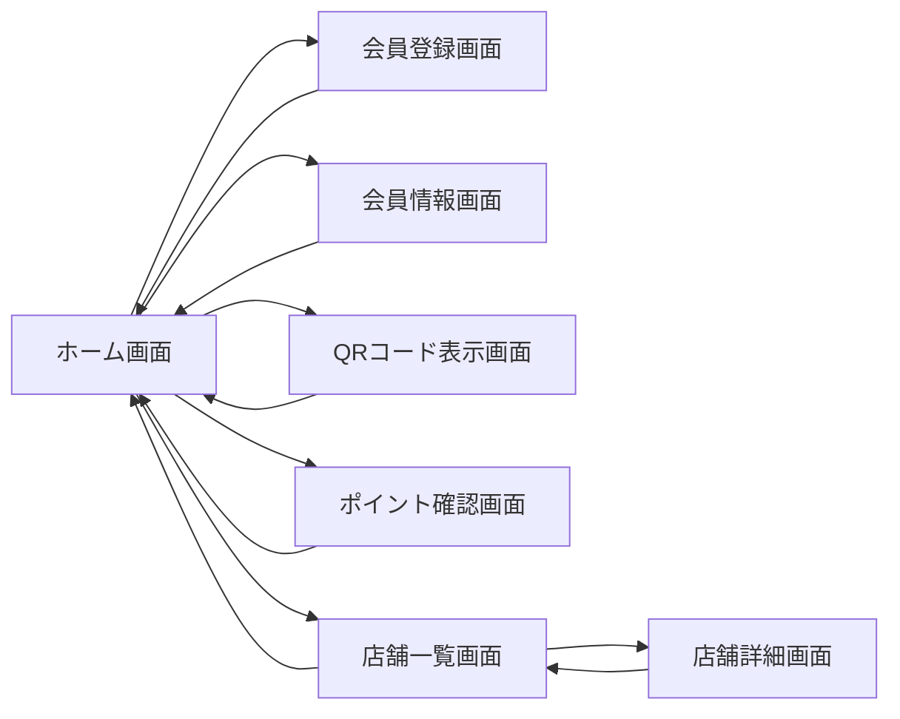
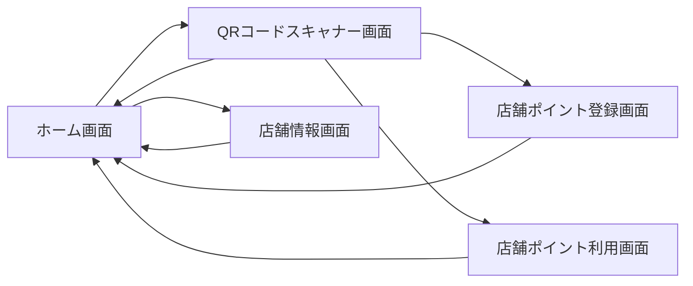

## 画面一覧

###  銀杏商店街アプリ（顧客向け）

#### 主要インターフェイス一覧

| 画面名           | 概要                                     | 対応ユースケース        |
| ------------- | -------------------------------------- | --------------- |
| **ホーム画面**     | ポイント残高、キャンペーン情報、店舗紹介などを一覧表示するダッシュボード機能 | 各画面へのナビゲーションの起点 |
| **会員登録画面**    | 電話番号とニックネームを入力し、アプリIDを生成して会員登録を行う      | UC-01 会員登録      |
| **会員情報画面**    | 会員のアプリID、ニックネーム、登録日時、累積ポイント等の情報を確認     | アカウント管理         |
| **QRコード表示画面** | 店舗スタッフに提示するための顧客用QRコードを表示              | UC-02 / UC-04   |
| **ポイント確認画面**  | 現在のポイント残高や利用履歴を表示                      | UC-03 ポイント確認    |
| **店舗一覧画面**    | 加盟店舗の一覧をカテゴリ別や距離順に表示                   | 店舗回遊・誘導         |
| **店舗詳細画面**    | 各店舗の詳細情報（地図、営業時間、ポイント特典など）を表示          | 店舗回遊・インセンティブ提供  |

#### 特徴

* 顧客の日常的な買い物やイベント参加を支援する多機能アプリ
* 「街を歩く → アプリでチェック → ポイントが貯まる」体験設計
* 地域回遊性や店舗情報の可視化で、商店街全体の活性化に貢献

#### 画面遷移

---

### 銀杏商店街店舗アプリ（店舗スタッフ向け）

#### 主要インターフェイス一覧

| 画面名              | 概要                                | 対応ユースケース         |
| ---------------- | --------------------------------- | ---------------- |
| **ホーム画面**        | 今日の来店数、最新処理履歴、ヘルプリンク等を表示するダッシュボード | 各機能へのナビゲーションの起点  |
| **QRコードスキャナー画面** | 顧客QRコードをカメラでスキャンし、ポイント付与や利用処理に移行  | UC-02 / UC-04    |
| **店舗ポイント登録画面**   | スキャン済み会員に対して、購入金額を入力してポイント付与      | UC-02 購入時のポイント付与 |
| **店舗ポイント利用画面**   | スキャン済み会員に対して、利用ポイント数を入力してポイントを減算  | UC-04 ポイント利用     |
| **店舗情報画面**       | 店舗名、登録日、利用状況など、店舗自身の情報を確認         | 店舗向け管理           |

#### 特徴

* 店舗スタッフがレジで即時操作できるよう、シンプルで高速なUI設計
* 「QR読み取り → 金額／ポイント入力 → 処理完了」の業務フローを1〜2画面で完結
* 店舗自身の情報確認も可能で、導入店の自立運用を支援

#### 画面遷移

