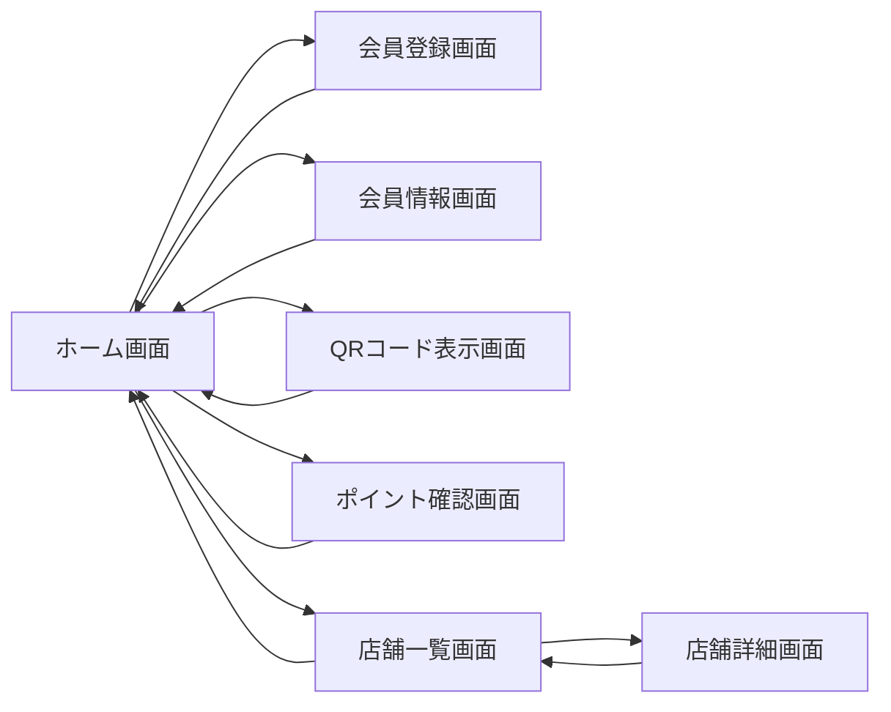

## アプリケーション仕様書：銀杏商店街アプリ（顧客向け）

### 1. はじめに

* 本アプリは銀杏商店街の共通ポイント制度を支援する顧客向けモバイルアプリである。
* 顧客が買い物やイベント参加でポイントを獲得・利用し、商店街への再来訪や地域回遊を促進することを目的とする。

### 2. 画面設計

#### 画面一覧

* ホーム画面
* 会員登録画面
* 会員情報画面
* QRコード表示画面
* ポイント確認画面
* 店舗一覧画面
* 店舗詳細画面

#### 各画面の詳細設計

* 会員登録画面：電話番号とニックネームを入力。登録ボタン押下でアプリID生成。
* ポイント確認画面：保有ポイント数と利用履歴を表示。

#### 画面レイアウト（省略）

#### 画面項目一覧（例：会員登録画面）

| 項目名    | 入力形式     | 制約条件      |
| ------ | -------- | --------- |
| 電話番号   | 数字（携帯番号） | 必須、一意性あり  |
| ニックネーム | 文字列      | 任意、最大20文字 |

#### 画面遷移図

### 3. 画面アクション（例）

| アクション名          | トリガー         | 処理内容                            |
| --------------- | ------------ | ------------------------------- |
| registerMember  | 登録ボタンクリック    | registerMember API 呼び出し、ホーム画面遷移 |
| getPointBalance | ポイント確認画面ロード時 | getPointBalance API 呼び出し、ポイント表示 |

### 4. エラー処理（例）

* 電話番号の形式不正：バリデーションメッセージ表示
* サーバ通信失敗："通信エラーが発生しました" とダイアログ表示

### 5. 非機能要件

* パフォーマンス：APIレスポンスは1秒以内
* セキュリティ：会員情報は暗号化保存、通信はHTTPS
* ユーザビリティ：高齢者も使いやすい大きなボタンとフォント
