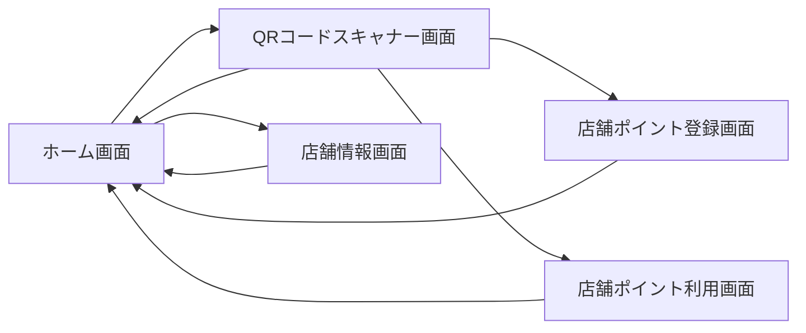

## アプリケーション仕様書：銀杏商店街店舗アプリ（店舗向け）

### 1. はじめに

* 本アプリは店舗スタッフが顧客にポイントを付与・利用処理を行うためのアプリである。

### 2. 画面設計

#### 画面一覧

* ホーム画面
* QRコードスキャナー画面
* 店舗ポイント登録画面
* 店舗ポイント利用画面
* 店舗情報画面

#### 各画面の詳細設計

* 店舗ポイント登録画面：スキャン済みQRコードの顧客IDに対して金額入力しポイント加算

#### 画面項目一覧（例）

| 項目名        | 入力形式 | 制約条件        |
| ---------- | ---- | ----------- |
| 金額         | 数値   | 必須、0以上      |
| ポイント数（利用時） | 数値   | 必須、0以上、残高以内 |

#### 画面遷移図

### 3. 画面アクション

| アクション名    | トリガー         | 処理内容                      |
| --------- | ------------ | ------------------------- |
| addPoints | 金額入力後ボタン押下   | addPoints API 呼び出し、加算完了表示 |
| usePoints | ポイント入力後ボタン押下 | usePoints API 呼び出し、減算完了表示 |

### 4. エラー処理

* QRコード読取失敗："読み取りに失敗しました" 表示
* 残ポイント不足："ポイント残高が不足しています" 表示

### 5. 非機能要件

* パフォーマンス：店頭で3秒以内の処理完了
* セキュリティ：ポイント処理は認証済み店舗端末からのみ可
* 操作性：最小ステップで処理完了するUI
