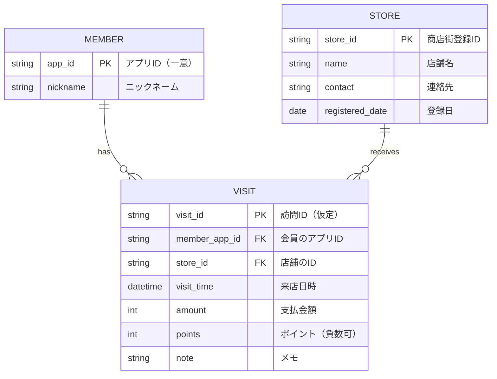

# 銀杏商店街ポイントシステム ビジネスレイヤー仕様書

## 1. はじめに

### ビジネスレイヤーの役割と範囲

本ビジネスレイヤーは、銀杏商店街ポイントシステムの中核的な処理を担うロジック群であり、顧客の会員登録、ポイントの付与・利用、店舗登録などの業務ロジックをAPIとして提供する。フロントエンド（顧客・店舗アプリ）や管理ツール、外部連携モジュールと連携して、ポイント制度全体の正確かつ信頼性のある運用を支援する。

---

## 2. データモデル

### データ構造（ER図）

### エンティティの詳細

#### MEMBER（会員）

| 属性名      | 型      | 説明     | 制約条件   |
| -------- | ------ | ------ | ------ |
| app\_id  | string | アプリID  | 主キー、一意 |
| nickname | string | ニックネーム | null不可 |

#### STORE（店舗）

| 属性名              | 型      | 説明      | 制約条件   |
| ---------------- | ------ | ------- | ------ |
| store\_id        | string | 商店街登録ID | 主キー    |
| name             | string | 店舗名     | null不可 |
| contact          | string | 連絡先     | null不可 |
| registered\_date | date   | 登録日     | 自動付与   |

#### VISIT（来店情報）

| 属性名             | 型        | 説明          | 制約条件         |
| --------------- | -------- | ----------- | ------------ |
| visit\_id       | string   | 訪問ID（仮定）    | 主キー          |
| member\_app\_id | string   | 会員のアプリID    | 外部キー（MEMBER） |
| store\_id       | string   | 店舗ID        | 外部キー（STORE）  |
| visit\_time     | datetime | 来店日時        | 自動付与         |
| amount          | int      | 支払金額        | 0以上          |
| points          | int      | ポイント（付与・利用） | 負数可          |
| note            | string   | メモ          | 任意           |

---

## 3. ビジネスロジック（API）

### API一覧

| API名            | 機能概要            |
| --------------- | --------------- |
| registerMember  | 会員登録を行う         |
| addPoints       | 購入時にポイントを加算する   |
| getPointBalance | ポイント残高を取得する     |
| usePoints       | 保有ポイントを利用して減算する |
| registerStore   | 加盟店舗を新規登録する     |

### 各APIの詳細

#### API名：registerMember

* 機能概要：携帯電話番号とニックネームから会員情報を登録
* 入力パラメータ：

  * `phoneNumber: string`
  * `nickname: string`
* 出力データ：

  * `Member { app_id, nickname }`
* 処理フロー：

  1. 入力された電話番号に基づき一意なアプリIDを生成
  2. MEMBERに登録
* エラー処理：

  * 電話番号が既存IDと重複：エラー返却

#### API名：addPoints

* 機能概要：支払金額に応じたポイントを加算し、来店情報を記録
* 入力パラメータ：

  * `memberId: string`
  * `amount: int`
* 出力データ：

  * `VisitInfo { visit_id, amount, points }`
* 処理フロー：

  1. 金額からポイント計算（例：100円=1pt）
  2. VISITに来店情報追加
* エラー処理：

  * 会員が存在しない：エラー返却

#### API名：getPointBalance

* 機能概要：会員の累積ポイント残高を返却
* 入力パラメータ：

  * `memberId: string`
* 出力データ：

  * `int`（ポイント残高）
* 処理フロー：

  1. VISITを参照し、全ポイントを集計
* エラー処理：

  * 会員が存在しない：エラー返却

#### API名：usePoints

* 機能概要：指定したポイント数を減算し、利用履歴として記録
* 入力パラメータ：

  * `memberId: string`
  * `points: int`
* 出力データ：

  * `VisitInfo { visit_id, points (negative) }`
* 処理フロー：

  1. 保有ポイントと比較して残高を確認
  2. 負のポイントでVISIT登録
* エラー処理：

  * 残高不足：エラー返却

#### API名：registerStore

* 機能概要：新規加盟店舗を登録
* 入力パラメータ：

  * `name: string`
  * `contact: string`
* 出力データ：

  * `Store { store_id, name, registered_date }`
* 処理フロー：

  1. 一意なstore\_idを生成
  2. STOREに登録
* エラー処理：

  * 入力不備：エラー返却

---

## 4. 外部システム連携

### 連携する外部システムの詳細

現時点では外部システムとの直接連携は定義されていない。ただし、将来的な行政補助金連携やスポンサー企業とのデータ連携が想定される。

### 連携方式（想定）

* 方式：REST API（JSON形式）
* プロトコル：HTTPS
* タイプ：非同期（Webhookベースで通知を受けるなど）

---

## 5. 非機能要件

| 項目         | 内容例                                            |
| ---------- | ---------------------------------------------- |
| パフォーマンス    | 各APIレスポンスは通常時1秒以内、ピーク時でも3秒以内                   |
| セキュリティ     | API認証にOAuth2を使用、通信はTLSにより暗号化                   |
| トランザクション管理 | 登録系ロジック（会員登録、来店情報追加、ポイント利用）はトランザクション境界内で整合性維持  |
| スケーラビリティ   | 会員数・来店情報量の増加に耐えるようNoSQLストレージまたはパーティション管理の導入を検討 |
| 可監視性       | CloudWatch等によるログ収集とエラーモニタリングを実施予定              |
