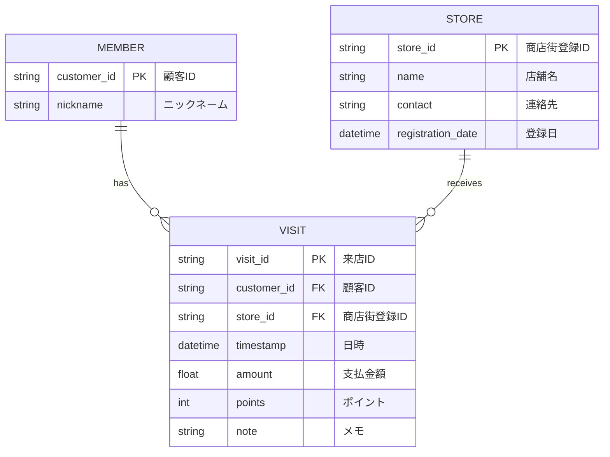

```mermaid
erDiagram
    STORE {
        string store_id PK "商店街登録ID"
        string name "店舗名"
        string contact "連絡先"
        datetime registration_date "登録日"
    }

    MEMBER {
        string customer_id PK "顧客ID"
        string nickname "ニックネーム"
    }

    VISIT {
        string visit_id PK "来店ID"
        string customer_id FK "顧客ID"
        string store_id FK "商店街登録ID"
        datetime timestamp "日時"
        float amount "支払金額"
        int points "ポイント"
        string note "メモ"
    }

    MEMBER ||--o{ VISIT : has
    STORE ||--o{ VISIT : receives
```
